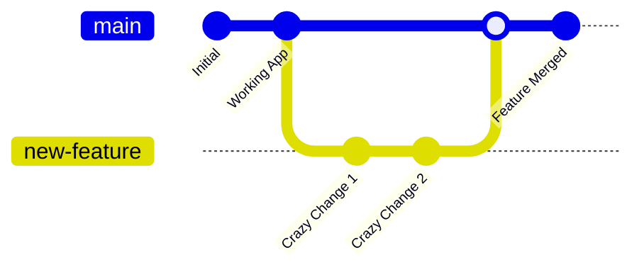

# 03. Git Version Control 🌳

Coding is messy. You will break things.
**Git** is your safety net. It's a Time Machine for your code.

## 1. Snapshots (Commits)
Imagine working on a doc without "Undo". Terrifying.
Git lets you take a photo of your code at a specific moment.
- `git add .`: "Stage these files for the photo."
- `git commit -m "Fixed the bug"`: "Take the photo and label it."

## 2. The Timeline (Log)
`git log` shows you every photo you've ever taken.
Did you break the app today?
Just travel back in time to yesterday's commit.
`git checkout <commit-id>`

## 3. Parallel Universes (Branches)
You want to try a crazy new feature, but you don't want to break the working app.
Create a **Branch**.

`git checkout -b new-feature`
You are now in a parallel universe. You can delete everything, changing nothing in the main universe (`main`).
If it works? **Merge** it back.
If it fails? **Delete** the branch. No harm done.

## 4. The Cloud (GitHub)
Git is on your computer.
**GitHub** is a website where you upload your Git history.
`git push origin main` -> "Upload my timeline to the cloud."
This is how teams work together.
