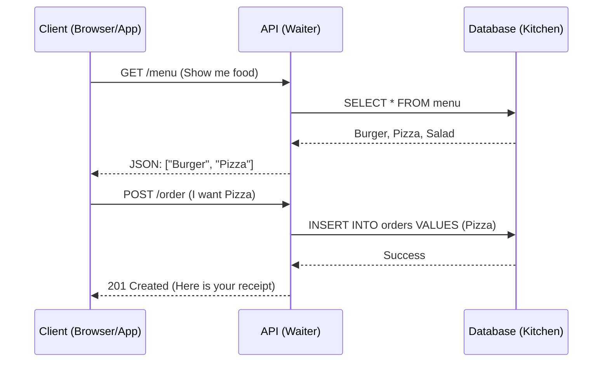

# 02. REST API Design 📡

**REST** (Representational State Transfer) is the etiquette of the internet. It's how your frontend asks your backend for data without crashing the party.

## 1. The Waiter Analogy
You (Client) sit at a table.
The Kitchen (Server) has the food (Data).
You cannot run into the kitchen and grab a burger.
You need the **Waiter (API)** to take your order and bring it back.



## 2. The Verbs (Methods)
Use the right verb, or you'll confuse the server.

| Method | Meaning | Real World Analogy |
| :--- | :--- | :--- |
| **GET** | **Read** | Asking for a menu. (Safe, changes nothing). |
| **POST** | **Create** | Submitting an order. (New data is created). |
| **PUT** | **Replace** | Sending back a dish to be completely remade. |
| **PATCH** | **Modify** | Asking for "No pickles" on the existing burger. |
| **DELETE** | **Remove** | Throwing the receipt in the trash. |

## 2. Endpoints: Clean URLs
Your URLs should read like directory paths, not function names.

- ✅ `GET /users` (Give me all users)
- ✅ `GET /users/123` (Give me User 123)
- ✅ `POST /users` (Create a new user)
- ❌ `GET /getUsers` (Redundant! The "GET" already implies "get")
- ❌ `POST /createUser` (Redundant!)

## 3. Status Codes: Stop Guessing
When the server replies, it holds up a numbered card to tell you what happened.

### Success
- **200 OK**: "Here is your data."
- **201 Created**: "I built it successfully." (Use after POST).

### Client Error (Your Fault)
- **400 Bad Request**: "You sent me garbage JSON."
- **401 Unauthorized**: "I don't know who you are. Log in."
- **403 Forbidden**: "I know who you are, but you can't touch this."
- **404 Not Found**: "This page is a ghost."

### Server Error (My Fault)
- **500 Internal Server Error**: "I crashed. The fire alarm is going off."

## 4. The JSON Standard
Don't send plain text. Send structured data so the frontend can parse it easily.

**Good Response:**
```json
{
  "status": "success",
  "data": {
    "id": 1,
    "username": "Jain",
    "role": "Admin"
  }
}
```
**Why?** If the request fails, you can change `"status"` to `"error"`, and the frontend knows exactly what to show the user.
