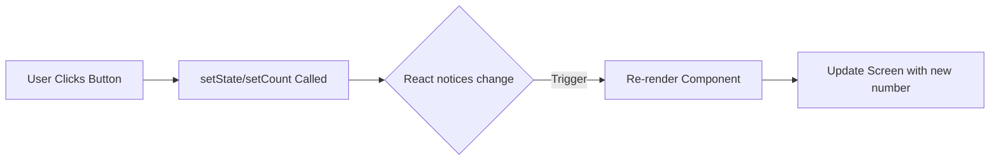

# 01. React Essentials ⚛️

React isn't just a library; it's a mental model shift.
Stop thinking in "Pages" and start thinking in "Components".

## 1. Components: The Legos of UI
Everything is a block. That blue button? A component. The header? A component.
You build small, isolated blocks and stack them together to make a sprawling app.

```jsx
// A reusable button block
function WelcomeBtn() {
  return <button>Click to Welcome</button>;
}
```

## 2. Props: Passing Data Down
Parents pass data to children.
Think of it like passing a lunchbox to your kid. The kid can consume it, but they can't change what's inside.

```jsx
function UserCard(props) {
  // Reading the name tag
  return <div className="card">Name: {props.name}</div>;
}

// Parent giving the name
<UserCard name="Jain" />
```

## 3. State (useState): The Living Brain
Normal variables (`let count = 0`) don't work in React.
If `count` changes, React doesn't know. The screen stays same.
You need special **State** variables.



```javascript
import { useState } from 'react';

function Counter() {
    const [count, setCount] = useState(0); // [CurrentValue, FunctionToChangeIt]
  return (
    // Clicking calls setCount, which triggers a re-paint
    <button onClick={() => setCount(count + 1)}>
      Clicked {count} times
    </button>
  );
}
```

## 4. Effects (useEffect): The Outside World
React is pure. But the web is messy.
You need to fetch data, listen to window resizing, or set timers.
**useEffect** is your bridge to the wild outside world.

```jsx
useEffect(() => {
  document.title = `Count: ${count}`;
}, [count]); // "Run this every time 'count' changes."
```
