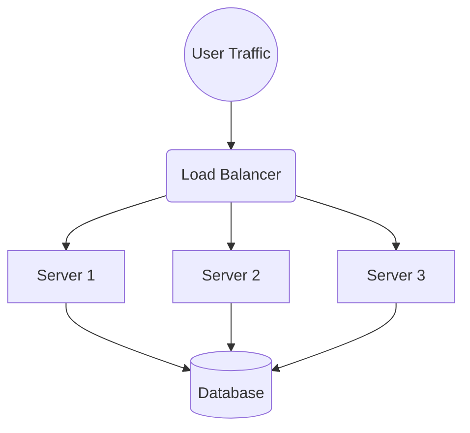

# 01. System Design 🏗️

Coding is bricklaying. System Design is architecture.
How do you build a system that acts like a single computer but is actually 1,000 servers spread across the globe?

## 1. Vertical vs Horizontal Scaling
- **Vertical (Scale Up)**: Buy a bigger server ($$$). Limit: One machine can only be so big.
- **Horizontal (Scale Out)**: Buy 10 cheap servers. Infinite limit.

## 2. Load Balancing
If you have 10 servers, who decides which one to talk to?
The **Load Balancer**. It's the traffic cop.

## 3. Caching (The Speed Hack)
You have 10 servers. Who gets the next customer?
A **Load Balancer** (like NGINX) sits at the front door.
"You go to Server 1. You go to Server 2."
It ensures no single server gets overwhelmed while others sleep.

## 3. CAP Theorem: You Can't Have It All
In a distributed world, pick 2:
1. **Consistency**: Everyone sees the latest data instantly.
2. **Availability**: The system never gives an error.
3. **Partition Tolerance**: The network can break, and we survive.

*Reality Check*: You cannot avoid P. So you must choose: **CP** (Errors are better than old data) or **AP** (Old data is better than errors).

## 4. Monolith vs Microservices
- **Monolith**: A giant castle. Strong, but if one wall crumbles, the whole thing might fall.
- **Microservices**: A village of small houses. If the Baker's house burns down, the Blacksmith is fine. Harder to manage, but safer at scale.
