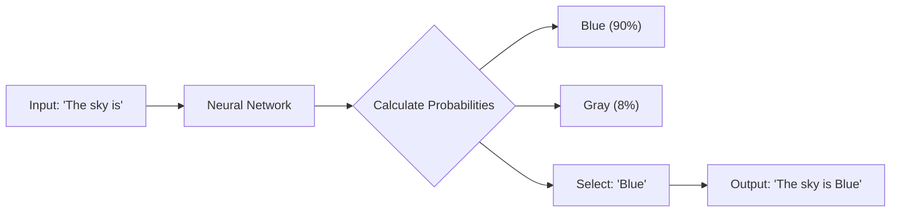

# 01. LLM Basics 🧠

Large Language Models (LLMs) are not "Logic Engines". They are "Prediction Engines".
They are incredibly fancy autocomplete.

## 1. It's just a Predictor
An LLM doesn't "know" facts. It knows "probability".
If you type "The sky is...", it calculates:
- "Blue": 90%
- "Gray": 8%
- "Potato": 0.001%

It picks the winner. Then keeps going.

## 2. Tokens (Not Words)
Computers don't read words. They read numbers.
"Apple" -> `[452, 109]` token.
- "Antigravity" might be 3 tokens ("An", "ti", "gravity").
**So What?** You pay for tokens. If your prompt is verbose, you are burning money.
*Rule of Math:* 1,000 tokens ≈ 750 words.

## 3. Context Window: Using Short-Term Memory
The "Context Window" is how much the AI can see at once.
- **Chat History**: Every time you reply, you send the *entire* conversation history back to the model.
- **Overflow**: If the conversation gets too long, the AI "forgets" the beginning. It fell off the edge of the window.

## 3. Temperature: Controlling Chaos
- **Low Temperature (0.1)**: "Be a Robot." Consistent, logical, repeatable. Use for Code.
- **High Temperature (0.9)**: "Be a Poet." Creative, random, surprising. Use for Brainstorming.

## 4. Hallucinations: Confident Lies
The AI wants to please you. If you ask for a library that doesn't exist, it might invent one just to be helpful.
*Trust, but Verify.* Never run AI code without reading it.
